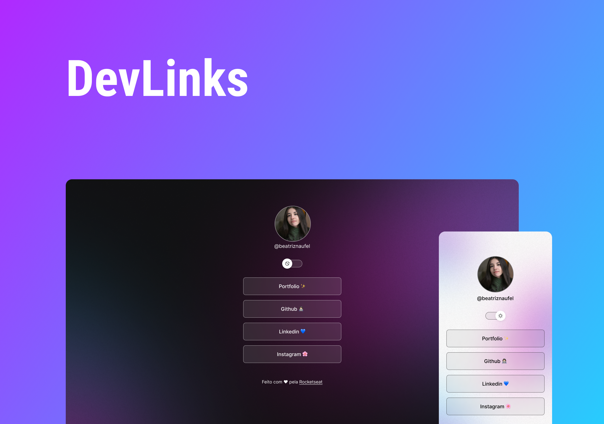

<h1 align="center"> DevLinks </h1>

Exclusive and free program, promoted by Rocketseat for teaching WEB technologies.  

  <a href="#-tecnologias">Tecnologies</a>&nbsp;&nbsp;&nbsp;|&nbsp;&nbsp;&nbsp;
  <a href="#-projeto">Project</a>&nbsp;&nbsp;&nbsp;|&nbsp;&nbsp;&nbsp;
  <a href="#-layout">Layout</a>&nbsp;&nbsp;&nbsp;|&nbsp;&nbsp;&nbsp;
  <a href="#memo-licença">Licence</a>

  

 

  

## 🚀 Techs

- HTML & CSS
- JavaScript
- Git & Github
- Figma

## 💻 Project

DevLinks is a link aggregator to use as an online business card.

## 🔖 Layout

You can view the layout of the project through [THIS LINK](https://www.figma.com/community/file/1187422022288947321).

## :memo: Licence

This project is licensed under the MIT license.

---

Made with ♥ by Maria Beatriz :wave: